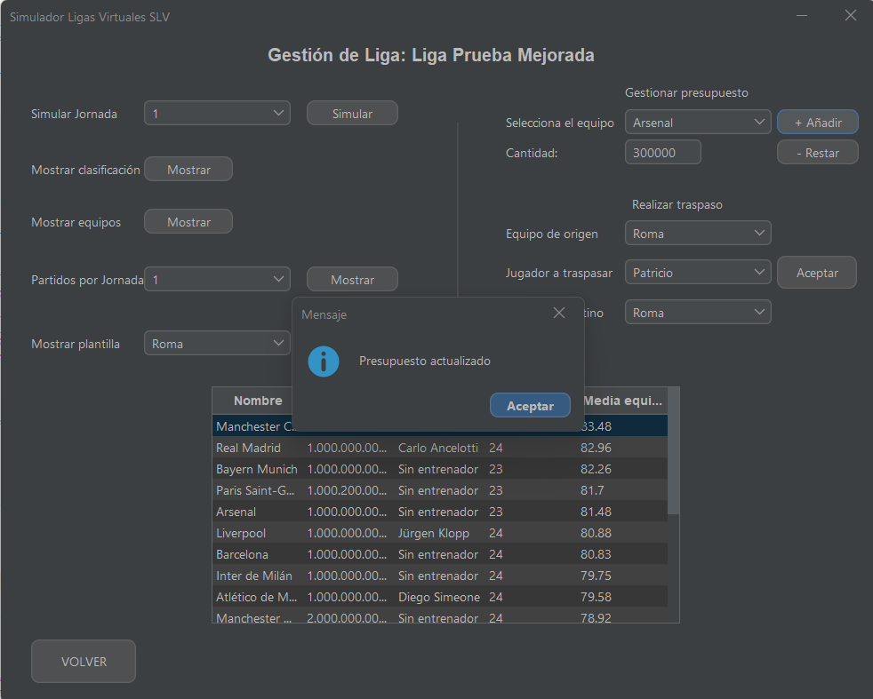

# Simulador de Liga (v0.8.5)

Este proyecto es una simulación realista de una liga de fútbol, desarrollada como ejercicio de aprendizaje en Java. Incorpora principios de programación orientada a objetos, modelado de entidades futbolísticas, persistencia completa en base de datos y el inicio de una interfaz gráfica en Swing.

---

## Funcionalidades principales

- **Persistencia total en MariaDB/MySQL**  
  Clase `GestorBD` con todos los métodos CRUD (`insert`, `update`, `delete`, `select`) para cada entidad (`Liga`, `Equipo`, `Entrenador`, `Jugador`, `Partido`).

- **Reconstrucción y continuidad**  
  Permite crear una liga, simular jornadas, cerrar el programa y continuar desde el mismo punto, recuperando todos los datos (incluyendo alineaciones, entrenadores y resultados) desde la base de datos.

- **Interfaz gráfica con Swing (versión 0.8 mejorada)**  
  - Pantalla principal de bienvenida.  
  - Panel de gestión (`GestionPanel`) con múltiples opciones:  
    - Simular jornadas  
    - Mostrar clasificación  
    - Consultar plantilla de cada equipo  
    - Visualizar partidos por jornada  
    - Consultar información general de los equipos  
  - `JTable` para mostrar resultados, plantillas y clasificación con formato mejorado.
  - Estética básica aplicada (colores alternos, alineación de columnas, fuentes legibles).

- **Gestión de presupuestos desde la GUI**  
  - Selección de equipo y campo numérico para añadir o restar presupuesto.  
  - Validación para evitar entradas no numéricas o negativas.  
  - Actualización automática en la tabla visual y en la base de datos.

- **Traspasos entre equipos (interfaz gráfica)**  
  - Selección del equipo de origen, jugador y equipo de destino.  
  - Actualización tanto en memoria como en base de datos (`id_equipo`).  
  - ComboBox dinámico que actualiza automáticamente los jugadores disponibles.  
  - Confirmación visual del traspaso y recarga en tabla.

- **Importación masiva desde archivo CSV**  
  Método `importarEquiposDesdeCSV()` en `GestorFicheros`, que permite cargar equipos completos (entrenador, plantilla, presupuesto) desde archivos `.csv`.

  - Formato esperado:  
    ```
    Equipo,Presupuesto,Entrenador,EstiloEntrenador,NombreJugador,Dorsal,Posicion,Media
    ```

- **Creación de equipos y entrenadores personalizados**  
  La clase `Entrenador` incluye un atributo `EstiloEntrenador` que afecta directamente a la simulación táctica (Defensivo, Ofensivo, Posesión, Contraataque).

- **Alineaciones automáticas realistas y validadas**  
  Selección automática de 11 titulares válidos según posición, media y estilo táctico.

- **Bonificaciones y penalizaciones en la simulación**  
  Según alineación, estilo del entrenador, y diferencias de media en cada línea (defensa, medio, delantera...).

- **Cálculo automático del número de jornadas**  
  Se adapta dinámicamente al número de equipos y a si la liga es de ida o ida/vuelta.

- **Generación completa del calendario**  
  Algoritmo de emparejamientos que garantiza un calendario realista y justo, sin repeticiones indebidas.

- **Simulación avanzada de partidos (`Simulador.java`)**  
  Tácticas, estilos y valores medios se traducen en probabilidades, ocasiones y goles simulados.

- **Clasificación y estadísticas automáticas**  
  Incluye: puntos, goles a favor, goles en contra y diferencia de goles, todo visible en tabla.

- **Exportación y carga de resultados desde fichero (`GestorFicheros`)**  
  Como alternativa a la base de datos, se puede usar persistencia en archivos `.txt` (modo offline o backup).


---

## Capturas de pantalla
Señaladas en rojo las principales acciones del panel de gestión.
El JTable se actualiza de forma dinámica tras seleccionar las distintas opciones.

### 1. Pantalla de inicio
Menú principal donde se puede crear una liga nueva o cargar una ya existente.


---

### 2. Creación de una liga
Formulario inicial para introducir el nombre, elegir si es ida/vuelta y seleccionar equipos desde CSV.


---

### 3. Panel de gestión
Desde aquí se puede simular una jornada, consultar partidos, clasificaciones, plantillas y presupuestos.
La interfaz incluye validaciones para evitar acciones incorrectas, como presupuestos negativos o traspasos inválidos.


---

### 4. Simulación de jornada
Permite simular la jornada seleccionada desde el combo. Si ya fue simulada previamente, se muestra un aviso y no se permite volver a simularla.

La información queda guardada en base de datos. Si se cierra el programa y se vuelve a cargar la liga, los partidos ya simulados siguen disponibles para continuar con la liga.


---

### 5. Consulta de plantilla
Vista detallada de los jugadores disponibles por equipo. Seleccionas el equipo que deseas mostrar.


---

### 6. Gestión de presupuestos
Interfaz con validación para modificar el presupuesto de un equipo concreto.
Lo actualiza de forma sincronizada en la base de datos y muestra los presupuestos tras actualizar.




---

### 7. Traspasos de jugadores
Selecciona jugador, equipo de origen y equipo destino. Se actualiza dinámicamente.


---

### 8. Consulta de partidos por jornada
Puedes visualizar los partidos de cualquier jornada seleccionando el número correspondiente en el combo desplegable. Se muestran local, visitante y resultado.


---

### 9. Tabla de clasificación
JTable con formato visual mejorado. Muestra puntos, goles y diferencia.


---

## Lógica de simulación de partidos (`Simulador.java`)

Cada partido simulado tiene en cuenta los siguientes factores:

- **Ventaja Local:** El equipo local recibe un 10% extra en probabilidad de gol por ocasión.
- **Probabilidad Base de Gol:**  
  - Local: 18% por ocasión  
  - Visitante: 15% por ocasión  
- **Ocasiones de gol iniciales:** 12 para cada equipo, modificadas según la táctica y las medias.
- **Modificadores por alineación:**  
  - Menos de 4 defensas: el rival gana +15% probabilidad de gol.  
  - Más de 4 defensas: el rival pierde -15% probabilidad de gol.  
  - Medios: 3 medios restan 2 ocasiones, 5 medios suman 4, 6 medios suman 6.  
  - Delanteros: 1 delantero -15% probabilidad propia, 3 delanteros +10%.
- **Media de líneas (portero, defensas, medios, delanteros):**  
  - Mejor portero: reduce la probabilidad rival.
  - Mejor defensa: penaliza ocasiones rivales.
  - Mejor medio: suma ocasiones propias.
  - Mejor delantera: aumenta probabilidad propia.
- **Estilo del entrenador:**  
  - Si el estilo es compatible con la táctica,  
    - DEFENSIVO: penaliza al rival (-5%).
    - OFENSIVO/POSESIÓN/CONTRAATAQUE: bonifica probabilidad propia (+5%).
- **Simulación probabilística:**  
  - Cada ocasión se simula como un "disparo": si `Math.random() < ProbabilidadGol`, se marca gol.
- **Actualización automática:**  
  - Goles, puntos y estadísticas se actualizan tras cada partido.

*Esto permite que la táctica, las medias y la coherencia estratégica tengan impacto real en el resultado, logrando una simulación variada y creíble.*

---

## Tecnologías utilizadas

- **Java 17**
- **NetBeans IDE**
- **JDBC + MariaDB**
- **POO (Programación Orientada a Objetos)**

---

## Dependencias externas

- FlatLaf (`flatlaf-3.4.jar`) — Estilo visual moderno para interfaces Swing
- OpenCSV (`opencsv-5.7.1.jar`)
- Apache Commons Lang (`commons-lang3-3.12.0.jar`)
- MariaDB Java Client (`mariadb-java-client-3.5.3.jar`)

---


## Documentación JavaDoc

Este proyecto incluye comentarios JavaDoc en las clases y métodos más relevantes.

### ¿Cómo generar la documentación?

Desde NetBeans:

1. Ve al menú `Run > Generate Javadoc`.
2. Se generará automáticamente en `dist/javadoc/index.html`.
3. Abre ese archivo en tu navegador para consultar la documentación.

> Puedes regenerarla en cualquier momento tras modificar los comentarios JavaDoc.

---


## Estructura del proyecto

- `/modelo` — Clases del dominio: `Equipo`, `Jugador`, `Entrenador`, etc.
- `/servicio` — Lógica principal: `Simulador.java`
- `/persistencia` — Persistencia en ficheros y base de datos: `GestorFicheros`, `GestorBD`
- `/vista` — Interfaz Swing: `MainFrame`, `GestionPanel`, `MenuPanel`, `CrearPanel`.
- `Main.java` — Entrada principal para pruebas o demo

---

## Próximas funcionalidades

- **Botón para reiniciar la liga** completamente (reset de partidos, jornadas y puntos).
- **Validaciones extra**: evitar plantillas inválidas, evitar presupuestos negativos, etc.
- **Paneles separados para gestión de equipos, traspasos y partidos**.
- **Reubicar la lógica del controlador para una estructura MVC total.**
- **Permitir alineaciones personalizadas desde la interfaz.**


---

## Estado del proyecto

**Versión 0.8.5** —  
**Novedades:** Versión funcional. Gestión de presupuesto y traspasos desde la GUI, integración visual de plantillas con `JTable`.  
Todo el ciclo de simulación, visualización y modificación de datos puede hacerse desde la GUI sin necesidad de reiniciar.
Implementación de estilo FlatLaf.

---


## Autor

**Alexis M.** — [GitHub](https://github.com/alexismr1988)
